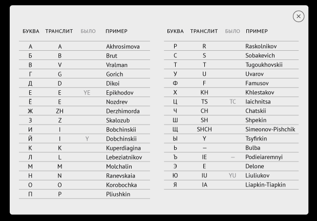

# Sberschoollesson4hwk
-----------------------------------------------------------------------------------------------------------------------------------------------------
## Лекция 4. View6 ViewGroup, Resources.

*Создать экран, у котором корневой ViewGroup будет ConstraintLayout.
В этой группе должно быть 2 TextInputLayout и 2 button.  
Один TextInputLayout позволяет ввести текст только с использованием русского алфавита, второй только английского.  
Одна кнопка транслитерирует текст из русского в английский, вторая наоборот.  
Правила транслитерации берем из:  
https://mishka.travel/blog/index/node/id/3807-novie-pravila-transliteracii-v-zagranpasportah-rf/*
-----------------------------------------------------------------------------------------------------------------------------------------------------
